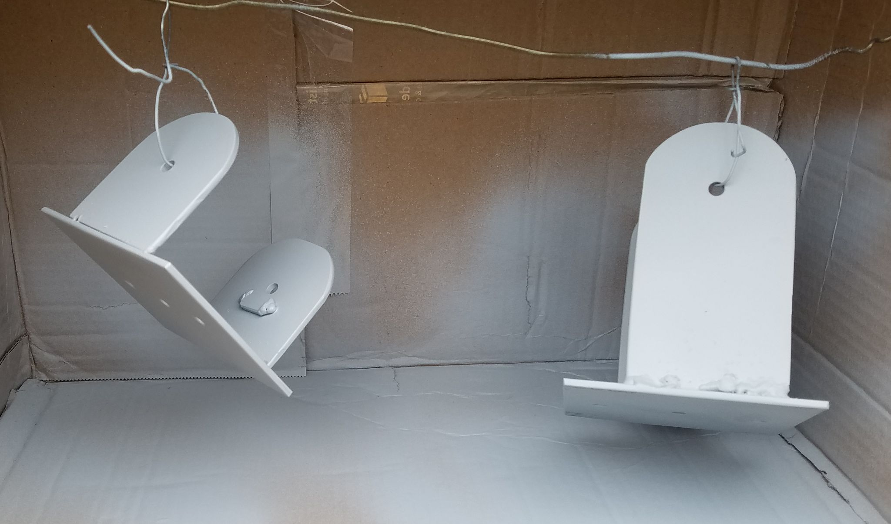
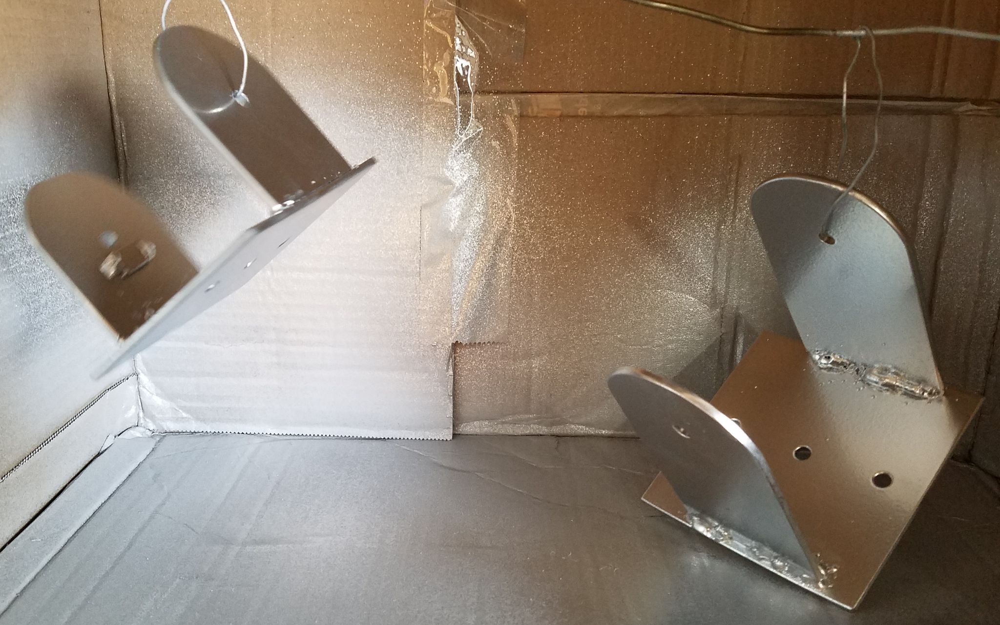
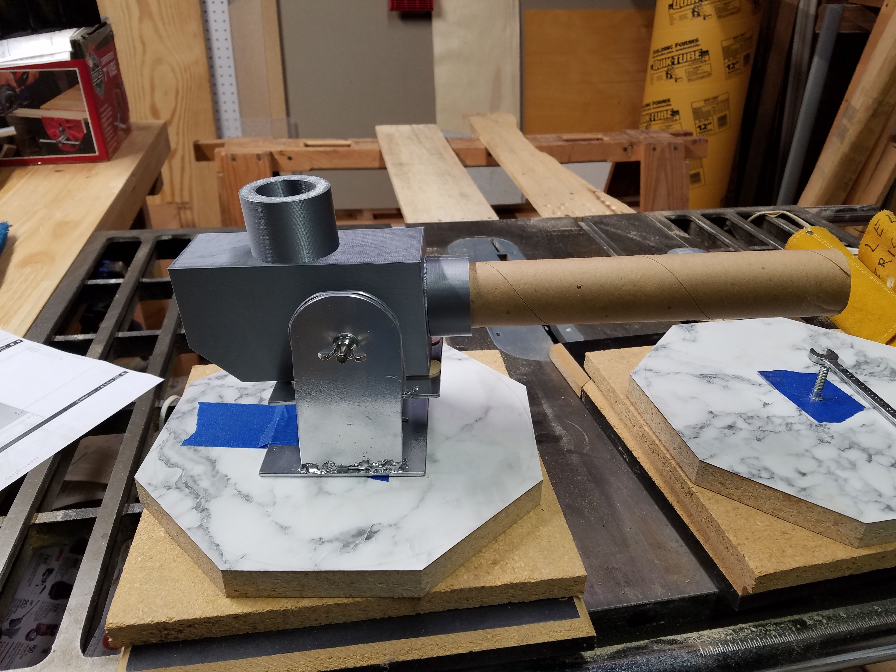
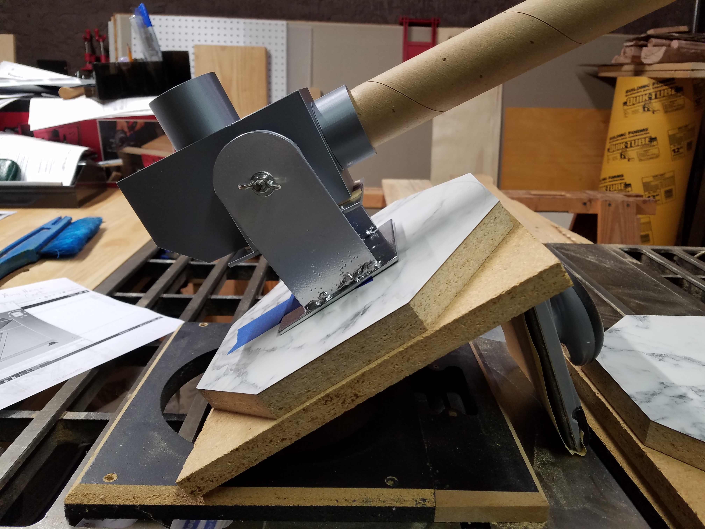
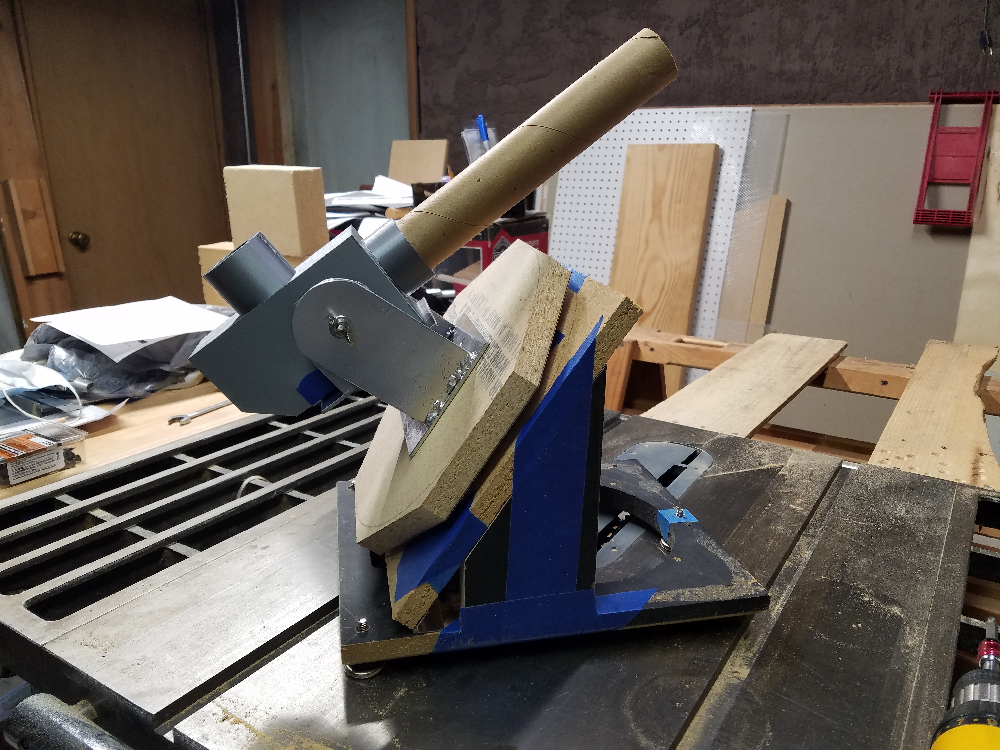

# Fabrication Photos
Personal Solar Telescope Mount.  
Hoping to get one finished for our next club meeting on 8 March 2024.   
***Reflections:  ***
My welding looks better under the slag.  I am way out of practice.  
I am suspecting that I need a heaver rod. I am using 5/64" rod type E6013.  Welder is set for 55 amps. The steel is 1/8" and so at the "T" joints I am welding 1/4" of material.  

## Paper Templates to guide fabrication.  
Apply painters tape and then the Paper Templates glued are glued to the tape. Removes much easier that way   

  
## Drilling Pilot Holes  
First 1/8 inch at high speed, 2700 RMP.   Then 1/4 inch at 1700 RPM.  

## Grind Radius  
I first removed most of the material with the hand held angle grinder and cutoff wheel. Finished creeping up to the line with a belt sander at 80 grit then 120 grit. Wish I had 240 grit belts.  

## Welding Setup  
Holding the brackets in line and of the correct width with all thread 1/4-20" rod.  
The 90 degree magnets help a lot.  

## Making Welds  
Making the welds and using painters tape to reduce welding splatter. It was better than nothing but there was burn through and still splatter. Unfortunatly the glue stuck to the work and was difficult to clean off. I am trying oven cleaner just now.  
My welds look much better under the slag.  
The 90 degree magnets help a lot.  

## Stop Turing Alt Bolt
A stop to prevent turning of the altitude lock bold.  

## In the Paint Booth
Prime and paint  

With Silver Paint  

## The Wood Working 
Improvising, the APE* parts.   

Rough Wood Work Side View  

(* Available Parts Engineering)

Going to need to design a latitude block soon  
  
Side view with temporary elevation block.

## Final Assembly
It is taking shape.  The skies will never clear.

An isometric view  

A side view  

Similar with paint  

An innovation this morning (20240403).  
Retention feature for telescope mounting screw.  
Cut from a Landry detergent bottle.
Note this retention requires the rubber feet be thicker than the retention washer. 
  
I drilled one size under 1/4" and made four cuts.

