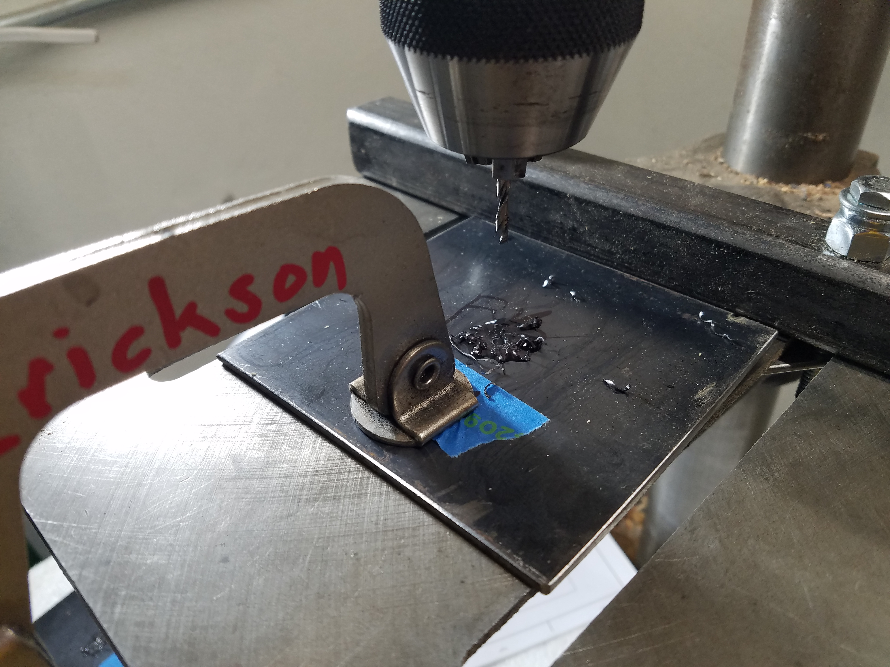
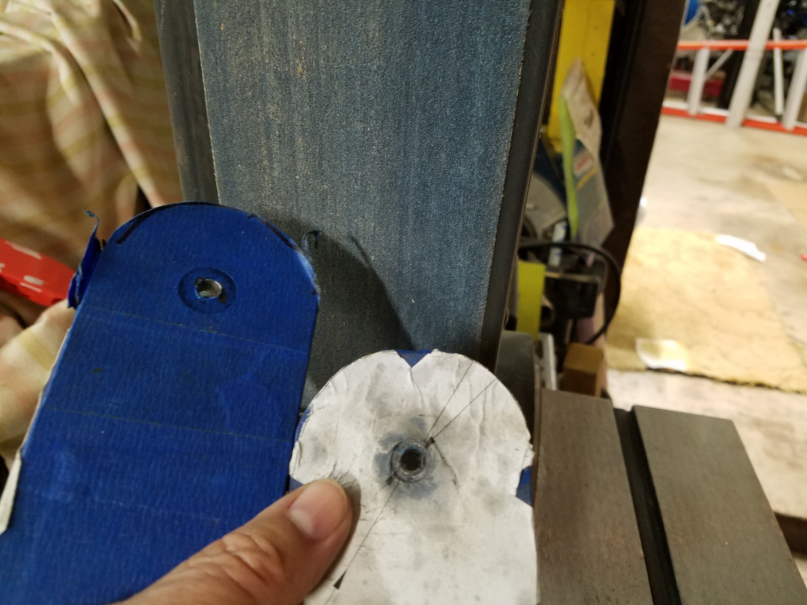
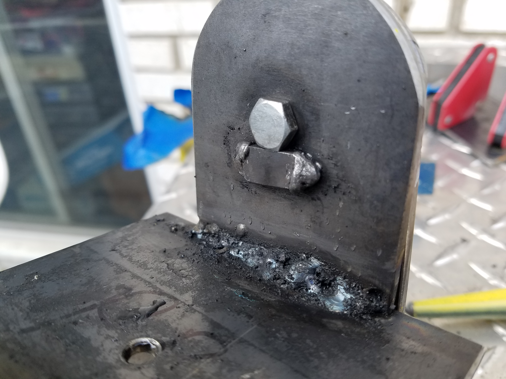

# Fabrication Photos
Personal Solar Telescope Mount.  
Hoping to get one finished for our next club meeting on 8 March 2024.   

## PaperTemplates to guide fabrication.  
Apply painters tape and then the Paper Templates glued are gluded to the tape. Removes much easier that way   

  
## Drilling Pilot Holes  
First 1/8 inch at high speed, 2700 RMP.   Then 1/4 inch at 1700 RPM.  

## Grind Radius  
I first removed most of the material with the hand held angle grinder and cuttoff wheel. Finished creeping up to the line with a belt sander at 80 grit then 120 grit. Wish I had 240 grit belts.  

## Welding Setup  
Holding the brackets in line and of the correct width with all thread 1/4-20" rod.  
The 90 degree magnets help a lot.  

## Making Welds  
Making the welds and using painters tape to reduce welding splatter. It was better than nothing but there was burn through and still splatter. Unfortunatly the glue stuck to the work and was difficult to clean off. I am trying oven cleaner just now.  
My welds look much better under the slag.  
The 90 degree magnets help a lot.  

## Stop Turing Alt Bolt
A stop to prevent turning of the altitude lock bold.  

