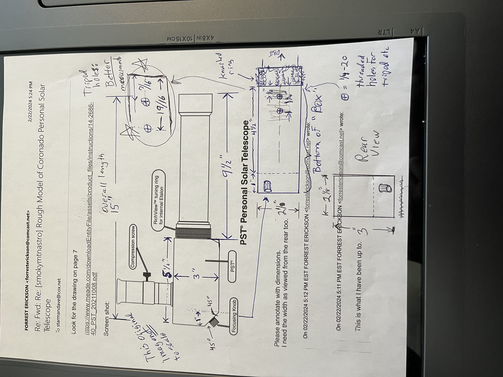

# Mount for Personal Solar Telescope
**WARNING NEVER LOOK AT THE SUN THROUGH A TELESCOPE, BINOCULARS, NAKED EYE, unless you have a known safe solar filter and you know how to use it.** 
Never make a home made filter out of unknown materials.  
Galileo was blind at the end of his life. I do not know how he observed sun spots, but he did. And he went blind. 

## Motivation
Several friends in the Smoky Mountain Astronomical Society, aka **[SMAS](https://groups.io/g/smokymtnastro)**, have the Coronado PST.  
I am hoping to help make them easier to use.  
I watched them try to use a camera tripod where the user has to loosen both the altitude and the azimuth axis by turning knobs, and then move the telescope in both axis to recenter the sun and then tighten both axis hoping that there is not stored spring energy (flex) in the tripod legs and then letting go only to have the sun poorly centered. Visitors at public events where the telescope owners wanted to share the experience were more often away from the eye piece than looking through it as the telescope owner was frequently repointing the telescope.
A tripod with a mass mounted to it forms something similar to a torsion pendulum and once disturbed it can take some time for oscillations do die down and novice observers bumping the telescope set them right back into motion.

The limited required altitude range of a solar telescope (only about 23 degrees above and below the celestial equator allows a small and sturdy table-top equatorial mount form factor which I set about to develop.

## CAD Drawing
Here is a photo made of the prototype part way through the development.

I want to not only build one or more mounts but share my work widely and so have placed my files and work on Github.
I used the free and open source 3D CAD modeling software FreeCAD to draw the parts and to combine them into an assembly to make the mount.

Of the first things I did was to model the Coronado Personal Solar Telescope starting with a sketch I found on the internet and with dimensions taken from a real telescope by one of the club members.
Made from measurements off a real PST 

From this drawing I made a 3D model of the body of the telescope (all but the long optical tube) and printed it out with an amusingly hollow body. TO this body I attached a cardboard tube approximating (but a bit smaller) than the real optical tube. 

## Prototype
An isometric view of  

## Project Summary
* Drawn in FreeCAD and using A2Plus work bench.  
* Drawing for the PST (Personal Solar Telescope) is only from a side view photograph and will not be accurate.  A part was 3D printed to help with my trial and error fabrication and iterative design.  
* The size of the base is arbitrarily based on a 254 mm (10") disk (Hexagon) about 12.5 mm (1/2") thick.  Base set for latitude near Maryville TN of 35.5 Degrees.
* Right Assention Pin is 1/4" (About 25.4 /4 mm).
* Before the 20240408 solar eclipse I fabricated four of these and got three into the hands of PST users so that they might benifit during the eclipse.  

## License and Warranty
  **License**: This project and files are dedicated and released to the public domain.  
  **Warranty:** This project and files are designed to kill you and render the earth uninhabitable, however they not guaranteed to do so.

